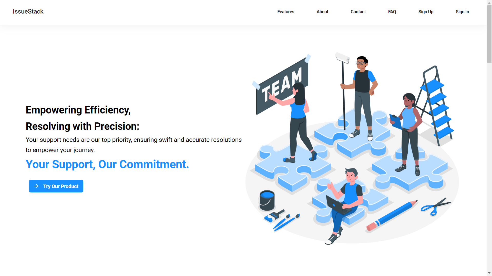
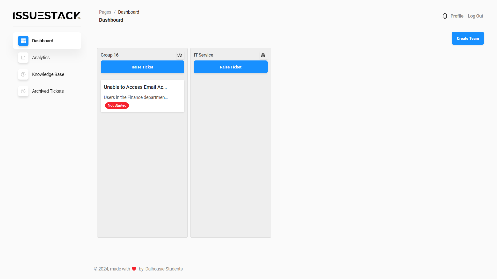
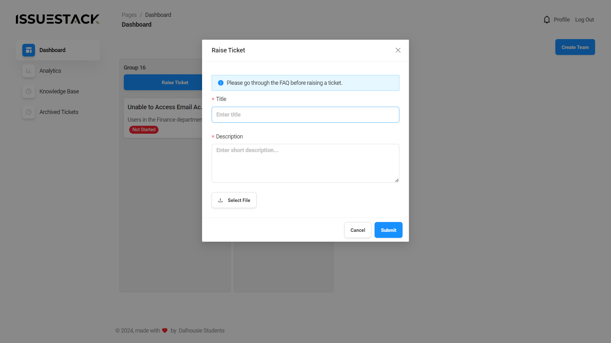
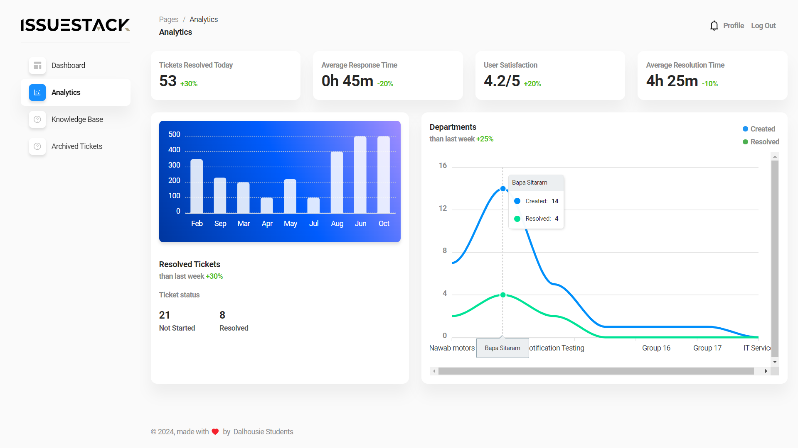

# IssueStack - Internal Support Ticket Tool [(Live App Link)](https://csci5709-web-project.netlify.app/)

  

 

### Hightlights (Screenshorts Attached ⬇️)
- > Internal Support Ticket Tool using MERN stack 
- > APP uses modern React and NodeJS features like ES Moduels, Async Await, Destructuring, Hooks, Context API, and Immutable Data Structures. 

## 🚀 Tech and Tools Used - MERN ⚒️🔥🔍

- React.JS 
- Redux
- NodeJS
- Express
- MongoDB
- VS Code
- Render
- REST APIS
- GoogleAPIs

## ⚙️ Features 🚀

- User Authentication by Email
- Profile Management/Settings
- Manage the issue Board
- Team Management/Team Assignment
- Raise Ticket in issue Board
- Automatic Ticket Assignment
- Ticket Management
- Comments on Ticket
- Email and In-app Notifications

## 📸 Screenshots

## Landing Page

## Ticket Dashboard

## Create Team

## Add Members to the Team

## Raise Ticket

## Ticket Details

## Analytics

## Knowledge Base

#
## Author : Bhautik Koshiya [(Github Profile)](https://github.com/BhautikKoshiya)

## Contact

If you have any questions, feel free to contact us. We appreciate your feedback!

## Acknowledgements

We would like to thank the open source community for their continuous support and inspiration. We are always learning and improving, thanks to you.